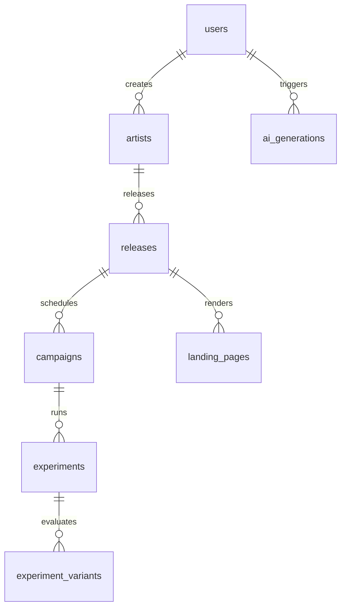

# ⚡️ DistroKid Growth OS

> [!IMPORTANT]
> **Disclaimer:** This project was created as part of an interview process and is not affiliated with, endorsed by, or operated by DistroKid.

A cinematic, experiment-driven marketing orchestrator and campaign delivery engine for music launches. Designed for high-impact visual aesthetics, automated audience funnels, real-time A/B testing, and programmatic release page generation.

---

## 🚀 Key Architectural Capabilities

### 1. Cinematic Launch Center

- **Aesthetic Shell:** A premium, dark-mode glassmorphic interface styled with custom radial grids, glow shadows, and responsive layouts.
- **Acquisition Funnels:** Interactive visualizer tracing live user progression from ad impressions (TikTok, YouTube, Instagram) to email capture and Spotify Pre-Saves.
- **Analytics Snapshots:** Real-time event streams mapping live fan interactions, page views, and attribution flows.

### 2. Campaign Studio (`/studio`)

- **Dynamic briefs:** An intuitive, multi-step brief creator tailored for music marketing campaigns.
- **AI Copywriter:** Mock AI generation layers utilizing `openai` integrations to output customized marketing captions, hook formats, landing copy, and SEO meta tags based on selected genres and release moods.
- **Interactive Playbook:** In-memory brief dispatch simulation that wires new campaigns directly into state and API endpoints.

### 3. Experimentation Engine (`/experiments`)

- **A/B Variant Manager:** Track, distribute, and weigh traffic variations across live campaigns.
- **Winner Analysis:** Dynamic statistical evaluation computing absolute conversion rates, total counts, and determining the optimal winning variant.

### 4. Interactive Playbook Demo Mode

- **Guided Onboarding:** A custom-built, fixed dashboard modal designed specifically for interview walkthroughs and developer evaluation.
- **Integrated Pathing:** Step-by-step guidance showing the exact flow from Campaign Studio Creation -> Launch Preview Verification -> Live In-Memory API Publication.

### 5. Programmatic SEO & Dynamic Pages

- **SEO Layout Renderer:** Automated render tree translating JSON layout blocks (e.g. Header, Media Grid, CTA) into high-fidelity custom themes.
- **Dynamic Release Slugs (`/landing/[slug]`):** Programmatic page routing with responsive components, programmatic OpenGraph image outputs, schema.org JSON-LD generation, and clean sitemap compilation.

---

## 🛠 Tech Stack

- **Framework:** [Next.js 15](https://nextjs.org/) (App Router, Dynamic Pages, Layouts, Metadata API)
- **Runtime & Languages:** React 19, TypeScript 5, Node.js
- **Styling & Motion:** [Tailwind CSS](https://tailwindcss.com/) & [Framer Motion](https://www.framer.com/motion/) (cinematic transitions, spring parameters, and interactive states)
- **State Management:** [Zustand](https://github.com/pmndrus/zustand) (playbook persistence, step configuration, draft sync)
- **Data Validation:** [Zod](https://zod.dev/) & [React Hook Form](https://react-hook-form.com/) (strict inputs, error boundaries)
- **Integration Utilities:** `@supabase/supabase-js`, `openai`, `posthog-js`
- **Icons:** [Lucide React](https://lucide.dev/) (modern vector icons)

---

## 📂 Project Architecture

```
distrokids-growth-app/
├── app/                       # Next.js App Router root
│   ├── analytics/             # Fan attribution & traffic volume graphs
│   ├── api/                   # Server endpoints (briefs, experiments, track)
│   ├── cms/                   # Internal scheduling & content configurations
│   ├── experiments/           # A/B variant tracking & statistical results
│   ├── landing/               # Programmatic landing pages & OG engines
│   ├── seo/                   # Dynamic SEO tags & validation rules
│   ├── globals.css            # Custom styling system, fonts, and HSL variables
│   ├── layout.tsx             # Root frame with custom font loading
│   └── page.tsx               # Home landing routing to GrowthHome
├── components/                # Modular React design system
│   ├── playbook/              # PlaybookManager modal onboarding flow
│   ├── ui/                    # Base visual tokens (button, input, badge, tabs)
│   ├── growth-home.tsx        # High-impact dashboard layout
│   ├── growth-shell.tsx       # Sidebar navigation and grid shell
│   └── theme-switcher.tsx     # Palette toggles & glowing effects
├── lib/                       # Unified utility layer
│   ├── ai.ts                  # Mock & OpenAI marketing brief generators
│   ├── analytics.ts           # Dynamic event tracker and attribution logic
│   ├── mock.ts                # Database seeding files for release models
│   ├── seo.ts                 # Programmatic meta tag & JSON-LD generators
│   └── supabase-schema.sql    # Relational Postgres modeling structures
├── tsconfig.json              # TypeScript engine configurations
├── tailwind.config.ts         # Palette definitions, spring utilities, and shadows
└── package.json               # Package dependencies & development workflows
```

---

## 💾 Relational Database Schema

Growth OS maps relational entities designed for high-scale analytical lookups. See [`supabase-schema.sql`](lib/supabase-schema.sql) for the implementation.



### Table Breakdown

- `users`: Base auth configurations for publishers and marketers.
- `artists`: Artist profile settings including custom genre tags and unique brand hex codes.
- `releases`: Detailed record of music assets, dynamic slugs, themes, and global drop dates.
- `campaigns`: Ad spend tracking, channel targets, objectives, and progress states.
- `experiments` & `experiment_variants`: Traffic distribution percentages, conversion triggers, payload objects, and variant results.
- `analytics_events`: Central event register logging clicks, conversions, source channels, and geo properties.
- `landing_pages`: Content block structures (stored as JSONB), design schemes, and sitemap definitions.

---

## ⚙️ Environment Setup

1.  **Clone the Environment Config:**
    ```bash
    cp .env.example .env.local
    ```
2.  **Populate Required Secrets:**
    - `NEXT_PUBLIC_SUPABASE_URL` / `NEXT_PUBLIC_SUPABASE_ANON_KEY`: Supabase database authentication keys.
    - `OPENAI_API_KEY`: Key for dynamic brief description synthesis.
    - `NEXT_PUBLIC_POSTHOG_KEY`: Key for tracking real-world user pathways.

---

## ⚡ Development Workflows

| Script              | Purpose                                             |
| :------------------ | :-------------------------------------------------- |
| `npm install`       | Install all required dependencies                   |
| `npm run dev`       | Run the local server at `http://localhost:3000`     |
| `npm run build`     | Compile Next.js production builds and verify routes |
| `npm run start`     | Spin up the local production-compiled project       |
| `npm run lint`      | Inspect code style and check code rules             |
| `npm run typecheck` | Perform TypeScript type safety inspection           |
| `npm run format`    | format codebase using Prettier                      |
